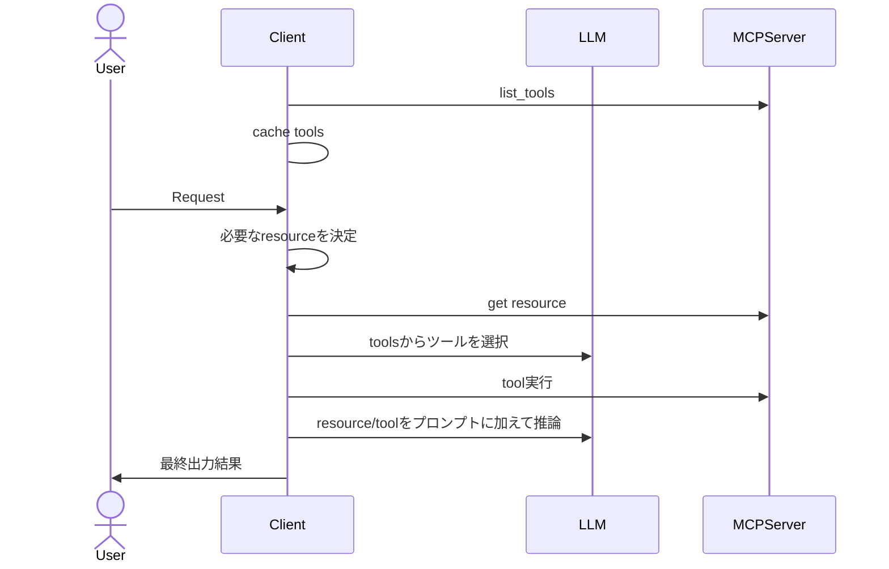

# mcp-samples
```
pip install fastmcp
```

# 各リソースの概念
https://modelcontextprotocol.io/introduction

## resource
推論に必要なcontextを取得。

動的なものはresource templateとも呼ばれる。

## tool
必要に応じて外部APIや関数を実行する。

モデルから実世界に繋ぐイメージ。


## prompt
プロンプトをサーバーから返すようにする。

管理をサーバーでしたいくらいのイメージか？


# ClientはどうMCP serverを使う？
OpenAIのAPIでは、toolsを`list_tools`で取得して、どれを使うか&パラメータを推論して`Approve`を求めるっぽい。
https://platform.openai.com/docs/guides/tools-remote-mcp

結果は`"role": "tool"`でmessagesにつなげる。
https://platform.openai.com/docs/guides/function-calling?api-mode=chat




