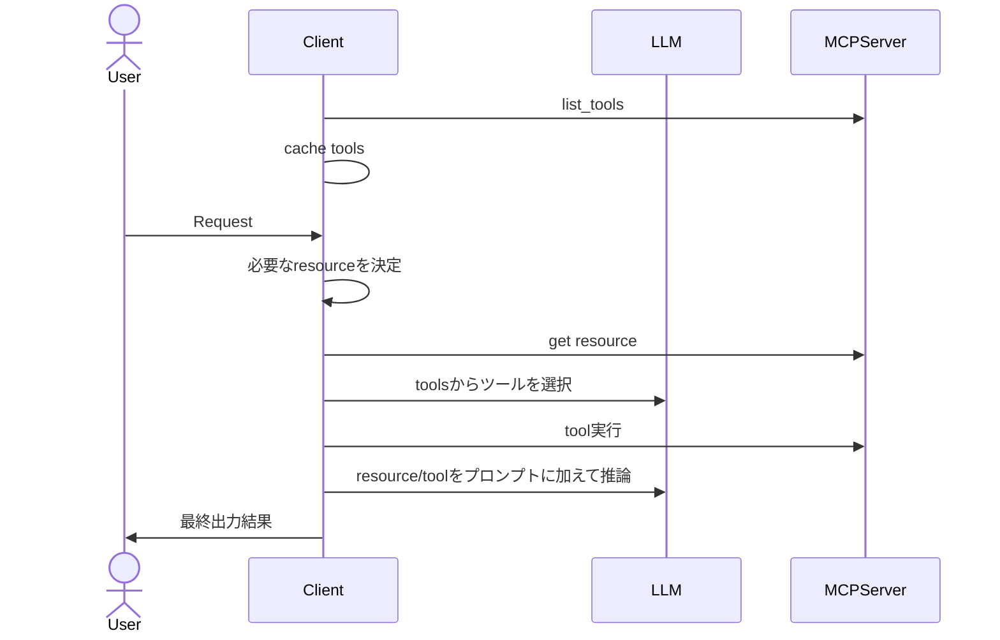
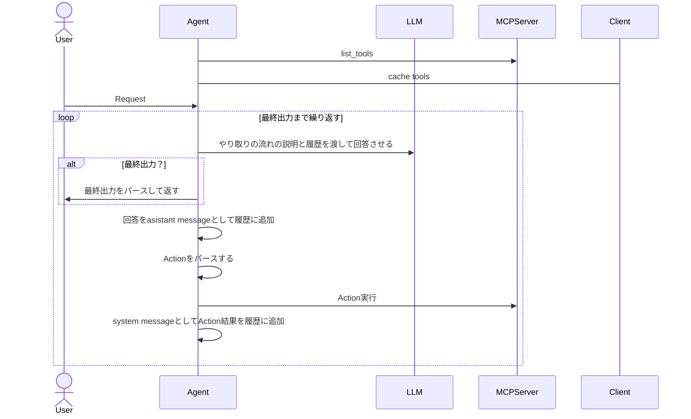

# mcp-samples
```
pip install pydantic
pip install fastmcp
pip install openai
```

## どうやって使う？
接続する側がtool/resourceの一覧を引っ張ってきて、それらから必要なtoolを実行する。

どう実行するか、どう決めるかは「AI agentのReAct」を参照。

### 例: Claude desktop
mcp-serverを起動する設定を設定ファイルに書いておけば勝手に立ち上げて接続してくれる。

接続に関しては上記のやり方もあれば、すでに起動済みのサーバーに対してhttpやstdioで繋いだり、実行ファイルをそのまましていすることもある。
その辺は`mcp-client/testserver_client.py`を参照。


# 各リソースの概念
https://modelcontextprotocol.io/introduction

## resource
推論に必要なcontextを取得。

動的なものはresource templateとも呼ばれる。

## tool
必要に応じて外部APIや関数を実行する。

モデルから実世界に繋ぐイメージ。


## prompt
プロンプトをサーバーから返すようにする。

管理をサーバーでしたいくらいのイメージか？


# ClientはどうMCP serverを使う？
OpenAIのAPIでは、toolsを`list_tools`で取得して、どれを使うか&パラメータを推論して`Approve`を求めるっぽい。
https://platform.openai.com/docs/guides/tools-remote-mcp

結果は`"role": "tool"`でmessagesにつなげる。
https://platform.openai.com/docs/guides/function-calling?api-mode=chat




# AI agentのReAct
論文。読むのしんどいから補足資料っぽいやつのみ参照。
https://arxiv.org/pdf/2210.03629


以下のイメージっぽい？

- Thought: 思考を推論させる
- Action: 何をアクション実行するか選ばせて、実際に実行
- Observation: アクション結果をプロンプトに含める

```
Thouth(with Observation) -> Action -> ...
```



## やり取りの流れのプロンプト
NVIDIAのサイトを参照。
https://docs.nvidia.com/agentiq/1.0.0/components/react-agent.html#react-prompting-and-output-format

こんな感じ。

```
以下の質問にできるだけ正確に答えてください。
質問:
{question}

---
以下のツールの使用ができます。

{tools}

以下の形式でやり取りします。
ツールを使用する際は以下の形式を厳守してください。

Question: 回答してほしい質問
Thought: 次に何をするべきか考える。
Action: アクション実行を要求する。[tools]のいずれかを使用できます
Observation: ツールの実行結果。
...(Though/Action/Observationを最終回答ができるまで繰り返します)
Thought: 最終回答ができるようになった。
Final Answer: 元の質問に対する最終回答を出力します。
```
