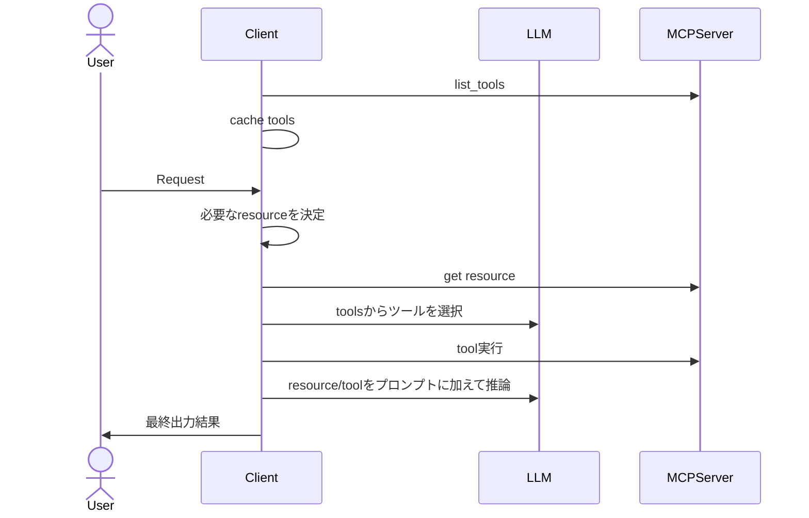
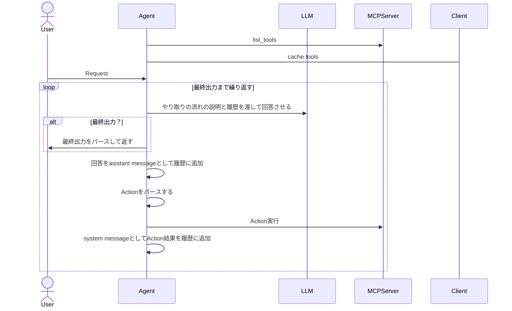

# mcp-samples
```
pip install pydantic
pip install fastmcp
pip install openai
```

# 各リソースの概念
https://modelcontextprotocol.io/introduction

## resource
推論に必要なcontextを取得。

動的なものはresource templateとも呼ばれる。

これはllmがresourceを選ぶとかではなく、固定だったりルールベースでclient側がどれ使うか選ぶものらしい。


## tool
必要に応じて外部APIや関数を実行する。

モデルから実世界に繋ぐイメージ。

どれを使うかをllmが選び、動的に使用するイメージ。


## prompt
プロンプトをサーバーから返すようにする。正直使いどころ分からん。

管理をサーバーでしたいくらいのイメージか？


# MCP Client
## MCPをどうやって使う？
接続する側がtool/resourceの一覧を引っ張ってきて、それらから必要なtoolを実行する。

どう使うかはclientの自由だが、どう決めるかなどのアーキテクチャ例は「AI agentのReAct」を参照。

### 例: Claude desktop
mcp-serverを起動する設定を設定ファイルに書いておけば勝手に立ち上げて接続してくれる。

接続に関しては上記のやり方もあれば、すでに起動済みのサーバーに対してhttpやstdioで繋いだり、実行ファイルをそのまましていすることもある。
その辺は`mcp-client/testserver_client.py`を参照。

### 例: openai
OpenAIのAPIでは、toolsを`list_tools`で取得して、どれを使うか&パラメータを推論して`Approve`を求めるっぽい。
https://platform.openai.com/docs/guides/tools-remote-mcp

結果は`"role": "tool"`でmessagesにつなげる。
https://platform.openai.com/docs/guides/function-calling?api-mode=chat


## シーケンス



# AI agentのReAct
agentのアーキテクチャの一つ。

論文。読むのしんどいから補足資料っぽいやつのみ参照。
https://arxiv.org/pdf/2210.03629


以下を推論させる

- Thought: 思考
- Action: 何をアクション実行するか、パラメータも含める
- Observation: アクション待機

その後にActionをClient側で実行して結果を履歴に含めて再度推論。
最終出力出たら終わりというイメージ。




## やり取りの流れのプロンプト
NVIDIAのサイトを参照。
https://docs.nvidia.com/agentiq/1.0.0/components/react-agent.html#react-prompting-and-output-format

こんな感じ。

```
以下の質問にできるだけ正確に答えてください。
質問:
{question}

---
以下のツールの使用ができます。

{tools}

以下の形式でやり取りします。
ツールを使用する際は以下の形式を厳守してください。

Question: 回答してほしい質問
Thought: 次に何をするべきか考える。
Action: アクション実行を要求する。[tools]のいずれかを使用できます
Observation: ツールの実行結果。
...(Though/Action/Observationを最終回答ができるまで繰り返します)
Thought: 最終回答ができるようになった。
Final Answer: 元の質問に対する最終回答を出力します。
```

# 試しに作ったReAct agent
上記のReActのシーケンスに従った実装を`ReAct-sample/main.py`に作ってみた。

`mcp-server/testserver.py`を起動してそことやり取りして回答をする。

質問は「5/20から5/31までの相手に連絡が必要そうな予定だけをして要約、テキストファイルに保存して」。

期待するのは以下の流れ

- 文章を解釈・思考
- 予定取得toolを実行要求 `mcp-server/testserver.py#get_events_from_calender()`
- 取得結果を見て、相手に連絡が必要そうな予定を抽出 (これはThoughtでmodel自身でやってほしい)
- テキストファイル保存toolを実行要求 `mcp-server/testserver.py#write_text_file()`
- 結果をまとめて最終出力

## 問題など
### 回答が不適切なときのリトライ
形式に合っていない出力やパースが正しくできないときのリトライが必要

### contextやtoken length問題
また、ツール数が少ないからうまくいくが、多くなるとトークン長が足りなくなる可能性もある。
その場合は、最初にmodelにツールを絞らせるとかいいかもしれない。

また、複雑な操作の場合はコンテキストウィンドウが足りなくなる可能性もある。

### チャットができない
これだとチャット形式ではなく1度の命令しか聞けないから、ユーザー回答待ちtoolとか用意するといいかも。

前回に続く新しい指示は、新たにQuestionを指定してprompt繋げるだけで良さそう。


### tool実行permission
これはActionが指定されたときに実行前にその都度出すのみなので簡単。
